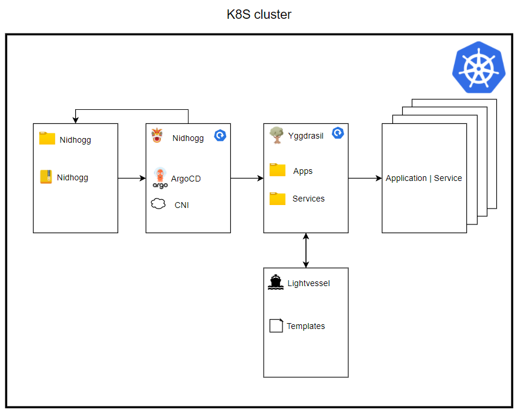
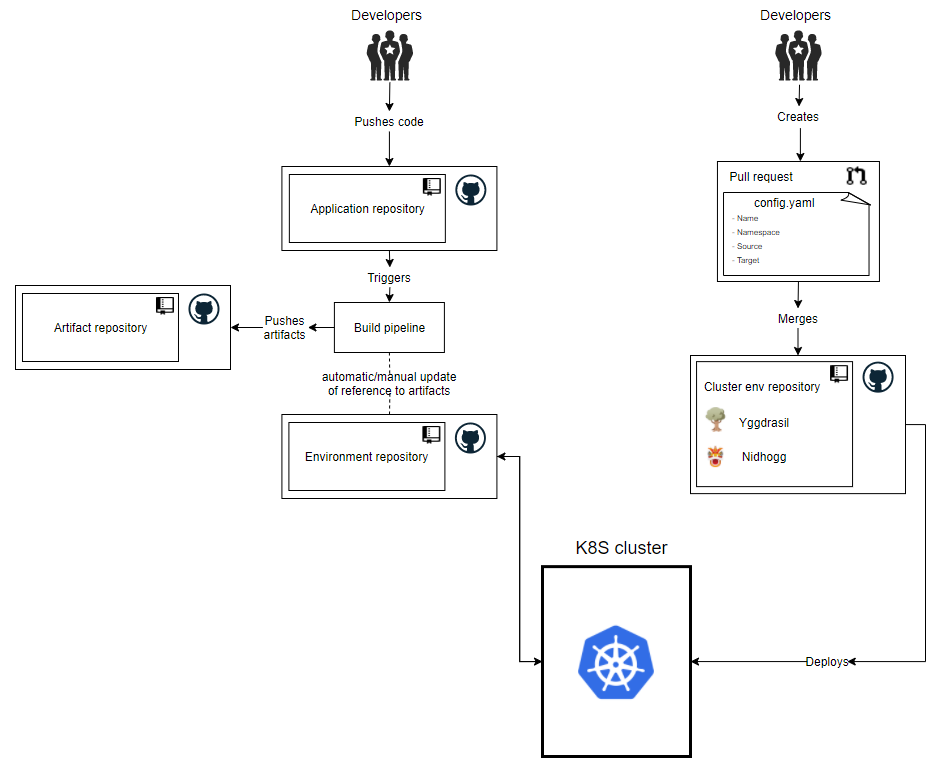

- [Yggdrasil](#yggdrasil)
  * [Principles](#principles)
    + [Application repository](#application-repository)
    + [Environment repository](#environment-repository)
    + [Yggdrasil](#yggdrasil-1)
    + [Application and service](#application-and-service)
  * [Charts in Yggdrasil](#charts-in-yggdrasil)
    + [Nidhogg](#nidhogg)
    + [Lightvessel](#lightvessel)
    + [Yggdrasil](#yggdrasil-2)
- [How to create your own cluster](#how-to-create-your-own-cluster)
    + [Cluster specific values](#cluster-specific-values)
- [How to add an application](#how-to-add-an-application)
    + [Step one](#step-one)
    + [Step two](#step-two)
  * [Installing chart](#installing-chart)
  * [Manual setup](#manual-setup)
    + [ArgoCD admin password](#ArgoCD-admin-password)
    + [Vault values](#vautl-values)
    + [Minio setup for argocd](#minio-setup-for-argocd)
* [Testing using kind](#testing-using-kind)
* [Known issues](#known-issues)

# Yggdrasil
This is the repository for the cluster environment. It contains two Helm charts called Nidhogg and Yggdrasil.

## Principles
When deciding on a workflow for deploying new applications and maintaining running applications on the cluster, we have adopted some of the principles from [GitOps](https://www.gitops.tech/). These principles will be defined in the following sections.

### Application repository
The application repository contains the source code of the application and the deployment manifests to deploy the application.

### Environment repository
The environment repository contains all deployment manifests of the currently desired infrastructure of an deployment environment. It describes what applications and infrastructural services should run with what configuration and version in the deployment environment.

### Yggdrasil
The cluster environment repository contains the configurations for each application on the cluster. It describes the names, namespaces, sources and destinations of any application that is running on the cluster.

### Application and service
Services that run on the cluster are the applications that are needed for cluster maintenance. This is for example Prometheus and Ceph. Applications refer to 3rd party applications or applications developed by distributed technologies and could refer to data science projects.

## Charts in Yggdrasil
This section describes the two charts found in Yggdrasil, Nidhogg and Yggdrasil.

### Nidhogg
Nidhogg is the first Helm chart to be installed and it bootstraps all the applications in our cluster. The Nidhogg chart has a single dependency which is on the Nidhogg release from [this repository](https://github.com/distributed-technologies/nidhogg). Contained in this Nidhogg release is two dependencies: ArgoCD and a CNI(container network interface). The CNI can be disabled by default in case your cluster already has a CNI. The chart also contains a reference to Yggdrasil. This will deploy everything within the Yggdrasil chart.
This is illustrated in the following image.


As stated, Nidhogg also contains a reference to Yggdrasil, which will be deployed onto the cluster. Yggdrasil is the chart that holds references to all the applications and services that will be deployed onto the cluster. This deployment happens automatically when Nidhogg and ArgoCD are deployed.

### Lightvessel
Lightvessel is a repository that holds all the templates necessary to deploy services and applications on the cluster. This is templated into Yggdrasil with the `define`-block from Helm. It was decided to separate this code from Yggdrasil to lower the need for updating your own cloned or forked code. Instead, we will release versions of Lightvessel and getting the newest update is as easy as changing the version on the dependency in Yggdrasil. The current templates are:
- _application.yaml: Where the application is defined, a source provided and a target provided.
- _namespace.yaml: Where the namespace is defined.
- _project.yaml: Where the ArgoCD project is defined if the application should be in a project.
- _ingress.yaml: Where Ingress is specified.

### Yggdrasil
Yggdrasil is the chart in which both developers and 3rd party developers will need to add their deployments into, to deploy them onto the cluster. Kubernetes manifests are generated using Helm templates from Lightvessel.

These templates will automatically generate new manifests when another application is created in Yggdrasil. This will be further elaborated in [How to add an application](#how-to-add-an-application).

In the next section, it will be described how to create your own cluster from this project.

# How to create your own cluster
Many of the design choices for Yggdrasil have been made to make it easier for internal and external organizations or developers to create their own cluster. Lightvessel and the Nidhogg release were made specifically so that there will rarely ever be a need to merge changes in from our version of Yggdrasil. The changes we make will be released in a Lightvessel or Nidhogg release and therefore it is only necessary to change the dependency version. This means that when you would like to create a new cluster, you can simply **clone** or **fork** this repository.

### Cluster specific values
The developers from Distributed Technologies at Energinet will not know your specific cluster details. Therefore, you have to define these yourself. Most of the cluster-specific values can be found and set in the file `nidhogg/values.yaml`. Included in these values is whether not to enable the CNI, the loadbalancer IPs and the IngressDomain. When these values have been set, you are now ready to [install the chart](#installing-chart).

In the next section, it will be described how to create the config and values file needed to deploy applications to the cluster.

# How to add an application
The workflow for deploying applications on the cluster is shown in the image below.


### Step one
The developers of either a 3rd party application or the maintainers of the cluster should create a new application reposity that contains the code for their app. When this code is committed, it should trigger a build pipeline that will update the artifact repository. After this, the environment repository will need to be either manually or automatically updates to reflect the new artifacts.

### Step two
Now that the application is created, the developers needs to create a pull request to Yggdrasil. Depending on if it is a service or an application, it should be in the correct folder. This pull request should add two files to a new folder in either the services or applications subdirectories. These files should be called config.yaml and <nameofapp>.yaml:

An example of the config.yaml is seen here:

```
name: <appname>
# whether it is a cluster service
namespace: <namespace>
description: <description>

project:
  # name of argocd project
  name: <projectName>
  # default cluster is https://kubernetes.default.svc
  server: <server>
  # default source repo should be '*'
  sourceRepos:
    - '<sourceRepo>'
  # if the project needs access to any namespace
  destinations:
    - namespace: <namespace>
      server: <server>

# This defines the applications that will be deployed.
# It is a list in cause you would like to deploy multiple applications
# to the same argocd project and namespace
apps:
  - name: <applicationName>
    ingressAnnotation:
      traefik.ingress.kubernetes.io/router.entrypoints: <entrypoint>
    ingress:
      <applicationName>:
        subDomain: <subdomain>
        path: <path>
        servicePort: <port>
        serviceName: <ServiceNameOfPrometheusService>
    source:
      repoURL: '<repoURL'
      # standard targetRevision is HEAD
      targetRevision: <branch>
      # path to Helm chart in repo. Should be . if Helm chart is in root.
      path: <path>
      # filename of values file that is local right next to this config.yaml file
      valuesFile: "<valuesFile>"
```

It is also possible to define a custom values file and place it in the same directory as the config.yaml. This values file should be named the same as the application it is providing the values for and then referenced in the config.yaml as you can see above. An example is given here:

```
name: <appName>
otherValue: <myValue>
project:
  indentedValue: <indentedValue>
```

This PR will then need to be approved by the cluster development team, before it is merged into Yggdrasil. When this is merged, ArgoCD will automatically deploy the application onto the cluster.
When the deployment is done, ArgoCD will poll the environment repository every 3 minutes, to check for changes to the application.

## Installing chart
To install Yggdrasil, you first need to navigate to the nidhogg directory and run `helm dependency update`.
Then, from the root directory of Yggdrasil, run the command `helm install --create-namespace -n yggdrasil nidhogg ./nidhogg`.

## Manual setup

### ArgoCD admin password
There is the need of changing the admin password this will be used to make sure that it's not the default password and that ArgoCD is not generating the secret to store the initial admin password.
<br>
https://argo-cd.readthedocs.io/en/stable/getting_started/#4-login-using-the-cli

So the repository includes a utility script for generating a random 64 char string and then bcrypt it since argocd requires the password to be bcrypted.<br>
https://argo-cd.readthedocs.io/en/stable/faq/#i-forgot-the-admin-password-how-do-i-reset-it

The bcrypted password should then be pasted into the nidhogg values file under `nidhogg.argocd.configs.secret.argocdServerAdminPassword`.
<br>
Then the `nidhogg.argocd.configs.secret.argocdServerAdminPasswordMTime` should be updated to the current time.

OBS!<br>
The non bcrypted password should then be added to the vault when that is ready.

### Vault values
There are some values needed in the Vault - the table below shows the information needed to configure the secret needed.<br>
This can be done by using port-forwarding or the url used `service-vault-poc...`<br>
The token used to login I located in the log of the vault-config job.

| path | key | dummy value |
|------|-----|-------------|
| k8s/secrets/sa-metrics | sa-name      | Storage account name |
| k8s/secrets/sa-metrics | sa-key       | Storage account key  |
| k8s/secrets/sso        | issuerurl    | https://login.microsoftonline.com/\<tenan-id\>/v2.0 |
| k8s/secrets/sso        | clientid     | The Id of the app in AzureAD |
| k8s/secrets/sso        | clientsecret | A secret from the app in AzureAD |
| k8s/secrets/sso        | jwtsecret    | A secret random secret |
| k8s/secrets/minio      | accesskey    | An access key for minio |
| k8s/secrets/minio      | secretkey    | An secret key for minio |
| k8s/secrets/argocd     | adminUsername| "admin" |
| k8s/secrets/argocd     | adminPassword| The non becrypted password from above |
| k8s/secrets/github-ssh | github       | The private key for github repo |
| k8s/secrets/github-ssh | github.pub   | The public key for github repo |

### Minio setup for argocd

There is also the need of configuring the minio for argo-workflows
Since it's currently not plausible to autogenerate a bucket - we need to generate one manually.
This is done by using the following command

    kubectl port-forward -n tooling svc/console 9090

This will alow us to access the minio-operator web-ui on http://localhost:9090
where you need a JWT token to log-in this can be gained by using

    kubectl -n tooling get $(kubectl get secrets -n tooling -o name| grep "minio-operator") -o jsonpath='{.data.token}' | base64 -di

use the output to log into the web-ui

1. click on the argo-artifacts tenant
2. click manage tenant
3. go to bucket in the left menu
4. click create bucket in the upper right button
5. give it the name `argo-artifacts`

That should be all that is needed for the minio setup for argo-workflows.

# Testing using kind

Create a kubernetes cluster using kind.

    kind create cluster --config ./test/kind.yaml

Install the nidhogg chart, which will bootstrap the rest of the process

    helm install --create-namespace -n yggdrasil nidhogg ./nidhogg

To see the argo, open the browser to [argo web gui](https://localhost:30080).

To remove the cluster after test use kind delete

    kind delete cluster

# Known issues
| Issue | optional |
|-------|-------------|
| Currently there are some problems with the PathPrefixStrip middleware and the forward-auth middlware. | https://github.com/thomseddon/traefik-forward-auth/pull/49 |
| There are also currently no way to get the token from the header. | https://github.com/thomseddon/traefik-forward-auth/pull/100 |